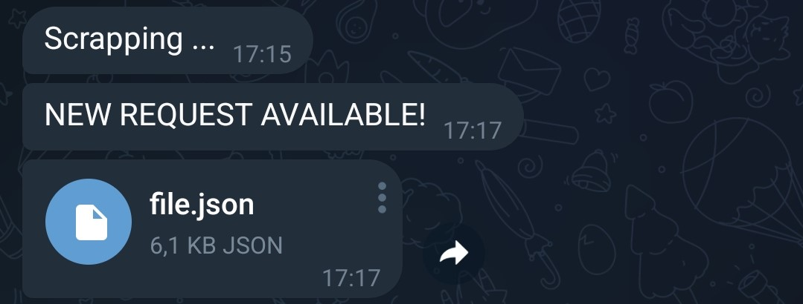
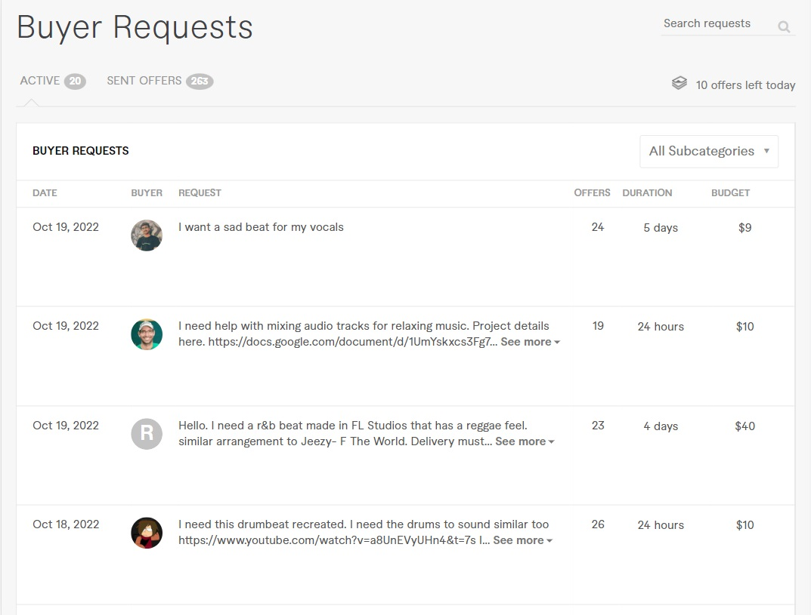
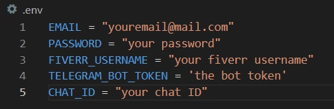

# Fiverr Web Scraper

This node script periodically scrapes Fiverr's "Buyer Requests" page, searches for new requests and send the result via Telegram bot.

## Context

Fiverr is a global online marketplace for freelance services. Sellers post their gigs and expect buyers to hire them. Buyers searches for services and hire sellers. Buyers also have the option to post requests and wait for offers from experienced sellers. Once the seller reaches certain level, the "Buyer Requests" page becomes available, which is a page that shows all buyer's requests related to the seller services with the option to get in touch with buyers and offer services. Of course it is up to the buyer to accept/reply the offer, but it is a good way for the seller to get more orders and make more money.

For some reason, Fiverr did not made available notifications when buyers post new requests, so sellers have to manually go over Buyer Requests page and see if there is anything new.

This script use puppeteer to log in Fiverr account (currently only for Google authentication), scrape Buyer Requests page, check if there are new requests and send the result via Telegram Bot periodically. This is a rough version since I'm a begginner, but I plan to improve it and add features in the future, or even redo it using different approaches.

*NOTE: Fiverr is replacing the "Buyer Requests" for something called "Opportunities". I don't know how this will work but it seems like the Buyer Requests page will no longer be available.*

## How to use the script

1. Clone this repository and run `npm init` to install dependencies

2. Create a Telegram bot using [Bot Father](https://t.me/botfather#:~:text=BotFather%20is%20the%20one%20bot,and%20manage%20your%20existing%20bots.) and get the BOT TOKEN.

3. Create a `.env` file and create the following variables using your information as values:

To get the CHAT ID, run the script for the first time with the `node index.js` command. Once the script start running send the message "chatid" to the BOT you created. You should receive a number. That's your chat id. 

4. Now everything is ready. You can use [pm2](https://pm2.keymetrics.io/) for running the script endlessly in the background.